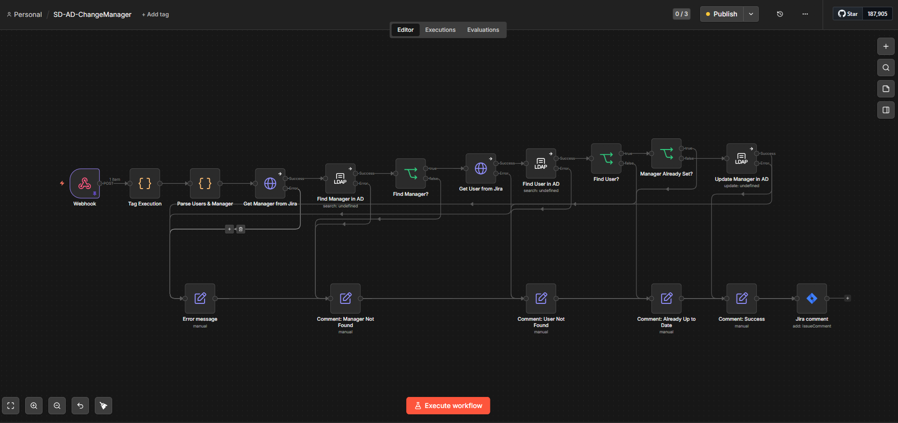

# SD-AD-ChangeManager

An n8n workflow that automatically updates the "Manager" attribute
in Active Directory based on data from a Jira ticket.

## Problem It Solves

Assigning a manager to an employee in AD was a manual process
that required IT involvement for every organizational change.
This workflow automates it: when a Jira ticket is created with
an employee and their manager specified - AD is updated automatically.

## Key Features

### Self-Service for HR
Access to submit manager change requests is granted to responsible
personnel (e.g. HR team) directly in Jira. This eliminates the need
to contact IT for every org structure change - HR can independently
initiate updates without any technical knowledge.

### Full Audit Trail
Every request creates a Jira ticket which serves as a log entry.
Once processed, the workflow posts a comment to the ticket with
the full details of what was changed:
Manager updated successfully.
Employee: John Smith
Previous Manager: Alice Johnson
New Manager: Bob Williams

This provides complete visibility into who changed what and when,
without any additional logging infrastructure.

## How It Works

1. Jira sends a webhook when a ticket is created
2. Workflow extracts accountId of the manager and employee from the request body
3. Fetches displayName of both users via Jira Cloud API
4. Searches for both users in Active Directory by displayName
5. Checks if the manager is already correctly set - skips update if so
6. If not - updates the `manager` attribute for the employee in AD
7. A comment with the result is posted back to the Jira ticket

## Tech Stack

- [n8n](https://n8n.io/) - workflow orchestration
- Jira Cloud REST API v3
- Active Directory (LDAP)

## Workflow Structure
Webhook → Tag Execution → Parse Users & Manager
→ Get Manager from Jira → Find Manager in AD → [found?]
→ Get User from Jira → Find User in AD → [found?]
→ Manager Already Set? → Update Manager in AD
→ Jira Comment (Success / Error / Not Found / Already Up to Date)

## Setup

1. Import `SD-AD-ChangeManager.json` into your n8n instance
2. Create the following credentials:
   - `httpHeaderAuth` - for webhook authentication from Jira
   - `jiraSoftwareCloudApi` - Jira API token
   - `ldap` (read) - service account for AD lookups
   - `ldap` (write) - service account for updating AD attributes
3. Replace placeholders in the workflow:
   - `YOUR_COMPANY.atlassian.net` → your Jira domain
   - `OU=YOUR_OU,DC=YOUR_DOMAIN,DC=LOCAL` → your AD baseDN
4. Configure the webhook in Jira (Automation for Jira)

## Error Handling

The workflow covers the following scenarios:
- Manager not found in AD
- Employee not found in AD
- Manager is already correctly set (skipped without changes)
- Jira API or AD request failure

In all cases an informative comment is posted to the Jira ticket.